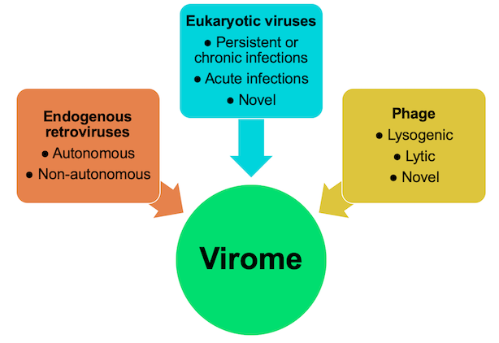

# ViroMatch

## A computational pipeline for detection of viral reads from complex metagenomic data.

### The Virome

The virome is the viral component of the microbiome. Viruses are a diverse group of microbes. They require a host cell for the production of new viral particles, but the hosts range from microbial to eukaryotic cells. There is no single gene that is common among the group. In fact, viral genomes are strikingly varied. They can be composed of DNA or RNA; double stranded or single stranded; positive sense or negative sense; non-segmented or segmented. The diversity in viruses adds complexity to genomic analysis of the virome. Next generation sequencing is well-suited to virome analysis, as it enables culture-independent assessment of any type of viral nucleic acid in samples ranging from sea water to human clinical samples. Sequencing allows the comprehensive characterization of the virome and discovery of novel viruses. We developed **ViroMatch** to analyze datasets of millions of short sequence reads to identify viral sequences. 

>**Figure.** The components of the virome that can be characterized by metagenomic sequencing. Viruses are a diverse group of microbes. Virome composition can include viruses that are present in or infect eukaryotic or microbial cells. Viruses can be acutely pathogenic to the host or establish long-term persistent or chronic infections. Viral genomes can be composed of  DNA or RNA, with genome sizes ranging from a few kilobases to megabases.

###  Viral Sequence Identification

The **ViroMatch** workflow incorporates both nucleotide and translated amino acid sequence alignment against a comprehensive database of viral reference genomes, which allows us the sensitivity to detect highly conserved and divergent viral sequences. Specifically, metagenomic sequences are first screened for putative viral reads by nucleotide alignment with BWA-MEM and translated alignment with Diamond against a database of viral genomes (downloaded from NCBI). This first screen is fast, but the hits include many false positives. Therefore, the putative viral hits are then aligned to the comprehensive NCBI nt nucleotide database using BWA-MEM and the comprehensive NCBI nr protein database using Diamond. Only sequences with an unambiguous alignment to a viral reference are counted as viral hits. Ambiguous hits (those that have alignments with similar scores to viruses and human, bacteria, etc.) are not counted. Ambiguous hits include those that map to repetitive regions that are not suitable for determining virus positivity. This pipeline has been used primarily for analysis of vertebrate viruses, including human viruses found in clinical samples.
