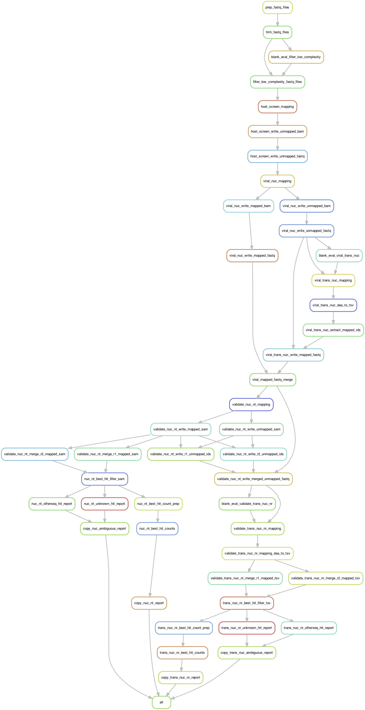

## ViroMatch Rulegraph of Steps

The following rulegraph was produced by Snakemake and shows the general directed acyclic graph for the steps in the pipeline. Steps are described in detail below.

{}Download PDF version of rulegraph.{}

## Steps (Snakemake Rules)

Here is a list of all of the steps/rules in ViroMatch's Snakefile, ordered by occurrence; each step of the pipeline and its purpose is outlined in detail. 

### 1. prep_fastq_files
The pipeline accepts a uBAM file or paired FASTQ files as `--input` from the command line. This step prepares the input file for downstream processing. If a uBAM file is supplied, it is converted to paired FASTQ files. Paired FASTQ input files are simply linked into the output directory for processing.

### 2. trim_fastq_files

The paired FASTQ files are adaptor trimmed in this step. Reads will be trimmed for adaptor (`--adaptor`), sequences will be trimmed/revised based on end-quality (`--endqual`), reads will be filtered based on the percent of N's allowed post-trimming (`--minn`), and too-short reads will be removed (`--readlen`).

### 3. blank_eval_filter_low_complexity

This step evaluates the resultant FASTQ files produced by the `trim_fastq_files` step to see if the FASTQ files are blank or have sequence entries present. Some of the executables in the pipeline will not accept "blank" FASTQ files, so this step prepares the next step in the pipeline if the files have no entries.

### 4. filter_low_complexity_fastq_file

The trimmed FASTQ files are evaluated for low-complexity in this step. Low-complexity bases are "hard masked" as N's in this step. Reads will also be filtered based on the percent of Ns allowed post-trimming (`--minn`).

### 5. host_screen_mapping

The trimmed and masked paired FASTQ sequences are mapped by nucleotide alignment to a reference host (`--host`) genome in this step.

### 6. host_screen_write_unmapped_bam

For the paired FASTQ files, the unmapped reads are partitioned into their own BAM files.

### 7. host_screen_write_unmapped_fastq

The unmapped host BAM files are converted to FASTQ format.

### 8. viral_nuc_mapping

The unmapped host FASTQ files (reads trimmed, masked, and did not map to host genome) are mapped by nucleotide alignment to a virus-only reference database in this step of the pipeline. Reads that map to this database have putative viral identities, but will undergo validation in later steps of the pipeline.

### 9. viral_nuc_write_unmapped_bam

Reads that were not mapped to the viral-only database are partitioned into their own BAM files.

### 10. viral_nuc_write_unmapped_fastq

Reads that were not mapped to the viral-only database are written to their own FASTQ files, from the unmapped BAM files.

### 11. viral_nuc_write_mapped_bam

Reads that were mapped to the viral-only database are partitioned into their own BAM files.

### 12. viral_nuc_write_mapped_fastq

Reads that were mapped to the viral-only database are written to their own FASTQ files, from the mapped BAM files.

### 13. blank_eval_viral_trans_nuc

This step evaluates the resultant FASTQ files produced by the viral nucleotide mapping steps to see if the FASTQ files are blank or have sequence entries present. Some of the executables in the pipeline will not accept "blank" FASTQ files, so this step prepares the next step in the pipeline if the files have no entries.

### 14. viral_trans_nuc_mapping

The reads (unmapped FASTQ files) that did not map to the viral-only databases by nucleotide alignment are aligned to a six-frame translated version of the same viral-only database by translated nucleotide alignment. Reads that did not map before may align in this manner given the greater sensitivity of the translated alignment approach.

### 15. viral_trans_nuc_daa_to_tsv

We convert the translated alignment results from their binary format to a human readable tab-delimited format.

### 16. viral_trans_nuc_extract_mapped_ids

We require the read ids in list format for the reads that mapped by translated alignment. This step collects the read ids for translated alignment mapped reads.

### 17. viral_trans_nuc_write_mapped_fastq

Based on the list of read ids for translated alignment mapped reads, we can write FASTQ files for just the reads that were mapped by translated alignment.

### 18. viral_mapped_fastq_merge

In this step, we merge all of the reads that were mapped by (1) nucleotide alignment and (2) translated nucleotide alignment. Cumulatively, these reads are representative of all of the putative viral identity reads from the original sequences input into the pipeline; however, these candidate reads must be further validated by the pipeline.

### 19. validate_nuc_nt_mapping

The candidate viral reads in the merged FASTQ files are now mapped by nucleotide alignment to all of the references in the NCBI nt database. While a read may have a good hit to the viral-only reference database, it may have a better or equally good hit to a non-viral reference in NCBI nt. Aligning to NCBI nt would be prohibitively slow for all input reads, so we only do this validation step for candidate reads that aligned to the virus-only database. NCBI nt is too large to index for alignment, so we have split nt into multiple indexed reference databases for independent alignment. A candidate read will be aligned to _all_ of the split nt databases and a best-hit will be determined by the pipeline downstream.

### 20. validate_nuc_nt_write_mapped_sam

All of the split nt alignment BAM files are converted to SAM format for the mapped reads in this step.

### 21. validate_nuc_nt_write_unmapped_sam

All of the split nt alignment BAM files are converted to SAM format for the unmapped reads in this step.

### 22. validate_nuc_nt_merge_r1_mapped_sam

For the read-1 FASTQ reads, all of the split nt SAM files for the mapped reads are merged into a single SAM file that is sorted by read id names. The SAM file needs to be sorted by read names because the pipeline's downstream best hit logic evaluates reads by _read blocks_: blocks of hits for the same read id.

### 23. validate_nuc_nt_merge_r2_mapped_sam

For the read-2 FASTQ reads, all of the split nt SAM files for the mapped reads are merged into a single SAM file that is sorted by read id names. The SAM file needs to be sorted by read names because the pipeline's downstream best hit logic evaluates reads by _read blocks_: blocks of hits for the same read id.

### 24. validate_nuc_nt_write_r1_unmapped_ids

For the read-1 FASTQ reads, we require the read ids in list format for the candidate viral reads that were not mapped to NCBI nt. This step collects the read ids for NCBI nt unmapped reads.

### 25. validate_nuc_nt_write_r2_unmapped_ids

For the read-2 FASTQ reads, we require the read ids in list format for the candidate viral reads that were not mapped to NCBI nt. This step collects the read ids for NCBI nt unmapped reads.

### 26. validate_nuc_nt_write_merged_unmapped_fastq

In this step, based on the unmapped read ids collected in previous steps, we pull the candidate reads that did not map to NCBI nt references and merge them into FASTQ files, one for each respective original read pair.

### 27. blank_eval_validate_trans_nuc_nr

This step evaluates the resultant FASTQ files produced by the NCBI nt mapping steps to see if the FASTQ files are blank or have sequence entries present. Some of the executables in the pipeline will not accept "blank" FASTQ files, so this step prepares the next step in the pipeline if the files have no entries.

### 28. validate_trans_nuc_nr_mapping

The FASTQ files (from step [#26](https://twylie.github.io/viromatch/overview/steps/#26-validate_nuc_nt_write_merged_unmapped_fastq)) contain the viral candidate reads that did not map to the NCBI nt database by nucleotide alignment. These reads will now be mapped to NCBI nr by translated nucleotide alignment. Reads that did not map before may align in this manner given the greater sensitivity of the translated alignment approach. Aligning to NCBI nr would be prohibitively slow for all input reads, so we only do this validation step for candidate reads that initially aligned to the virus-only database, but did not align to NCBI nt. NCBI nr is too large to index for alignment, so we have split nr into multiple indexed reference databases for independent alignment. A candidate read will be aligned to _all_ of the split nr databases and a best-hit will be determined by the pipeline downstream.

### 29. validate_trans_nuc_nr_mapping_daa_to_tsv

We convert the translated alignment results from their binary format to a human readable tab-delimited format.

### 30. validate_trans_nuc_nr_merge_r1_mapped_tsv

For the read-1 FASTQ reads, all of the split nr TSV files for the mapped reads are merged into a single TSV file that is sorted by read id names. The TSV file needs to be sorted by read names because the pipeline's downstreamn best hit logic evaluates reads by _read blocks_: blocks of hits for the same read id.

### 31. validate_trans_nuc_nr_merge_r2_mapped_tsv

For the read-2 FASTQ reads, all of the split nr TSV files for the mapped reads are merged into a single TSV file that is sorted by read id names. The TSV file needs to be sorted by read names because the pipeline's downstream best hit logic evaluates reads by _read blocks_: blocks of hits for the same read id.

### 32. nuc_nt_best_hit_filter_sam

In this step, the candidate viral reads that mapped to NCBI nt are evaluated. For each candidate read, all of the associated hits (read block) for the read are evaluated and a best representative hit is chosen. It is during this step that the pipeline writes sanity files which describe the pass/fail status for all of the hits evaluated. A SAM file is written for the chosen viral best hits.

### 33. trans_nuc_nr_best_hit_filter_tsv

In this step, the candidate viral reads that mapped to NCBI nr are evaluated. For each candidate read, all of the associated hits (read block) for the read are evaluated and a best representative hit is chosen. It is during this step that the pipeline writes sanity files which describe the pass/fail status for all of the hits evaluated. A TSV file is written for the chosen viral best hits.

### 34. nuc_nt_otherseq_hit_report

The pipeline now generates a report for hits to _other sequences_ taxonomy based on the sanity reports from step [#32](https://twylie.github.io/viromatch/overview/steps/#32-nuc_nt_best_hit_filter_sam).

### 35. nuc_nt_unknown_hit_report

The pipeline now generates a report for hits to _unknown_ taxonomy based on the sanity reports from step [#32](https://twylie.github.io/viromatch/overview/steps/#32-nuc_nt_best_hit_filter_sam).

### 36. trans_nuc_nr_otherseq_hit_report

The pipeline now generates a report for hits to _other sequences_ taxonomy based on the sanity reports from step #33.

### 37. trans_nuc_nr_unknown_hit_report

The pipeline now generates a report for hits to _unknown_ taxonomy based on the sanity reports from step [#33](https://twylie.github.io/viromatch/overview/steps/#33-trans_nuc_nr_best_hit_filter_tsv).

### 38. nuc_nt_best_hit_count_prep

In this step, the nucleotide alignment SAM files from step [#32](https://twylie.github.io/viromatch/overview/steps/#32-nuc_nt_best_hit_filter_sam) that contain the best viral hits against NCBI nt are combined into a data matrix that includes associated taxonomy for reporting purposes.

### 39. trans_nuc_nr_best_hit_count_prep

In this step, the translated nucleotide alignment TSV files from step #33 that contain the best viral hits against NCBI nt are combined into a data matrix that includes associated taxonomy for reporting purposes.

### 40. nuc_nt_best_hit_counts

This step generates a report file that describes viral read counts based on nucleotide alignments at genus, species, and full lineage levels.

### 41. trans_nuc_nr_best_hit_counts

This step generates a report file that describes viral read counts based on translated nucleotide alignments at genus, species, and full lineage levels.

### 42. copy_nuc_nt_report

The report from step [#40](https://twylie.github.io/viromatch/overview/steps/#40-nuc_nt_best_hit_counts) is copied into the main output directory for review.

### 43. copy_trans_nuc_nr_report

The report from step [#41](https://twylie.github.io/viromatch/overview/steps/#41-trans_nuc_nr_best_hit_counts) is copied into the main output directory for review.

### 44. copy_nuc_ambiguous_report

The report from steps [#34](https://twylie.github.io/viromatch/overview/steps/#34-nuc_nt_otherseq_hit_report) and [#35](https://twylie.github.io/viromatch/overview/steps/#35-nuc_nt_unknown_hit_report) are copied into the main output directory for review.

### 45. copy_trans_nuc_ambiguous_report

The report from steps [#36](https://twylie.github.io/viromatch/overview/steps/#36-trans_nuc_nr_otherseq_hit_report) and [#37](https://twylie.github.io/viromatch/overview/steps/#37-trans_nuc_nr_unknown_hit_report) are copied into the main output directory for review.

